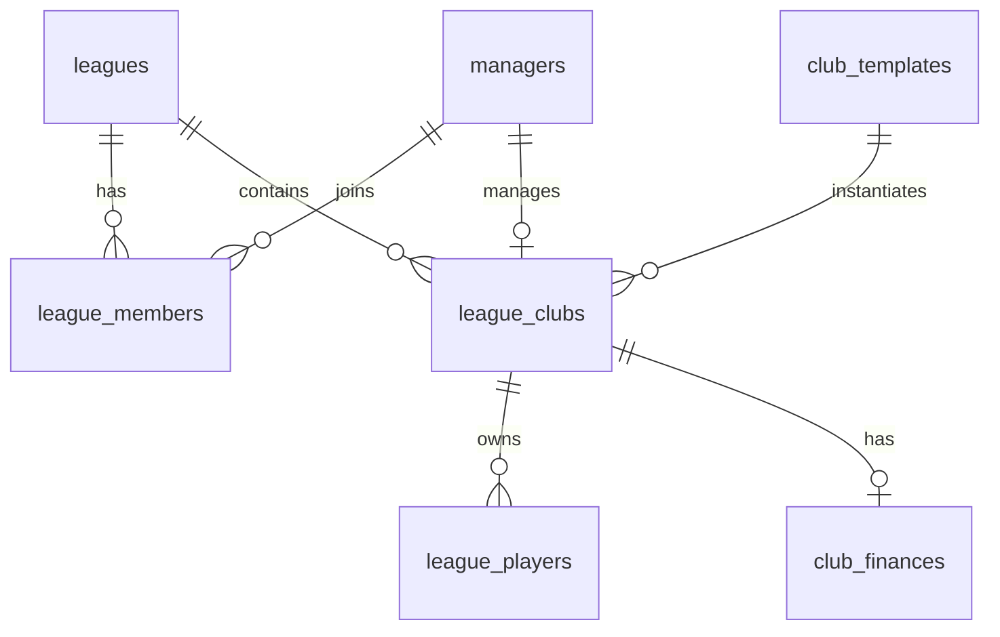
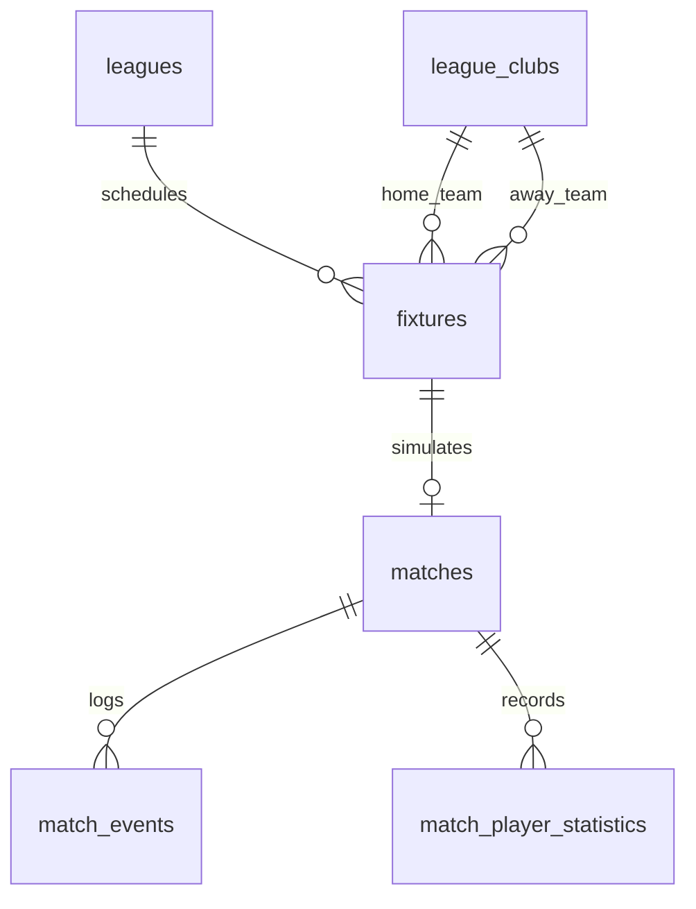

# Telegram Football Manager - Kengaytirilgan Ma'lumotlar Bazasi Arxitekturasi (DATABASE_PLAN.md)

Ushbu hujjat **Telegram Football Manager** loyihasining to'liq normalizatsiya qilingan (3NF/BCNF), yuqori unumdorlikka ega hamda ma'lumotlar yaxlitligi qat'iy muhofaza qilingan **Supabase PostgreSQL** ma me'lumotlar bazasi arxitekturasini belgilaydi.

> **ESLATMA:** Ushbu hujjat loyiha bazasining to'liq va rasmiy spesifikatsiyasi hisoblanadi. Hali hech qanday SQL migratsiya fayllari yoki baza jadvallari yaratilmagan.

---

## 1. Umumiy Baza Arxitekturasi va Prinsiplari (Architectural Principles)

1. **To'liq Normalizatsiya (Strict Normalization):**
   Ma'lumotlar yaxlitligini saqlash va duplikatsiyalarning oldini olish uchun yirik ob'ektlar sun'iy ravishda `JSONB` ustunlariga joylashtirilmaydi. Har bir mantiqiy sub-ob'ekt (pozitsiyalar, taktik sozlamalar, transfer tarixi, o o'yin statistikasi) alohida relatsion jadvalga ega.
2. **Global Shablonlar va Liga Nusxalari Ajratilishi (Template vs Instance Separation):**
   Global shablonlar (`club_templates`, `player_templates`) va liganing jonli ob'ektlari (`league_clubs`, `league_players`) to'liq ajratilgan. Global shablonlarning admin tomonidan yangilanishi allaqachon boshlangan faol ligalarga hech qanday ta'sir o'tkazmaydi.
3. **Immutabilitet va Audit (Immutable Ledgers):**
   Moliyaviy operatsiyalar (`financial_ledger`), ma'muriy amallar (`admin_audit_logs`) hamda transfer muzokaralari tarixi (`transfer_offer_history`) faqat qo'shish rejimida (`append-only`) ishlaydi va o o me'zgartirilmaydi.
4. **Qat'iy Bazaviy Cheklovlar (Database-Level Enforcement):**
   Tizim xavfsizligi faqat dastur kodiga emas, balki bazaning `CHECK`, `UNIQUE`, `FOREIGN KEY` cheklovlari hamda PostgreSQL Triggers, Stored Functions va Advisory Lock mexanizmlariga tayanadi.

---

## 2. ENUM Turlari (Database Enums)

Baza darajasida quyidagi rasmiy `ENUM` turlari yaratiladi:

```sql
CREATE TYPE enum_league_status AS ENUM ('LOBBY', 'STARTING', 'ACTIVE', 'COMPLETED', 'CANCELLED', 'PAUSED');
CREATE TYPE enum_league_member_role AS ENUM ('OWNER', 'MEMBER');
CREATE TYPE enum_club_control_type AS ENUM ('HUMAN', 'BOT');
CREATE TYPE enum_round_status AS ENUM ('SCHEDULED', 'IN_PROGRESS', 'COMPLETED', 'FAILED');
CREATE TYPE enum_fixture_status AS ENUM ('SCHEDULED', 'PLAYED', 'CANCELLED');
CREATE TYPE enum_transfer_offer_status AS ENUM ('PENDING', 'ACCEPTED', 'REJECTED', 'COUNTERED', 'CANCELLED', 'EXPIRED', 'FAILED', 'COMPLETED');
CREATE TYPE enum_transfer_window_status AS ENUM ('OPEN', 'CLOSED');
CREATE TYPE enum_financial_transaction_type AS ENUM ('STARTING_BUDGET', 'TRANSFER_OUT', 'TRANSFER_IN', 'TRANSFER_RESERVE', 'RESERVE_RELEASE', 'FEE');
CREATE TYPE enum_notification_status AS ENUM ('QUEUED', 'PROCESSING', 'SENT', 'FAILED');
CREATE TYPE enum_scheduled_job_status AS ENUM ('PENDING', 'RUNNING', 'COMPLETED', 'FAILED');
CREATE TYPE enum_player_availability_status AS ENUM ('AVAILABLE', 'INJURED', 'SUSPENDED');
CREATE TYPE enum_admin_role AS ENUM ('SUPER_ADMIN', 'SYSTEM_ADMIN', 'MODERATOR');
```

---

## 3. Jadvallar Sxemasi (Complete 45 Tables Schema)

Ma me'lumotlar bazasi 9 ta mantiqiy domenga bo'lingan **45 ta alohida jadvaldan** tashkil topgan:

### DOMAIN 1: IDENTITY AND ACCESS (Identifikatsiya va Kirish)

#### 1. `managers`

- **Vazifasi:** Telegram foydalanuvchilarining asosiy akkaunt yozuvi.
- **PK:** `id UUID`
- **Ustunlar:** `telegram_id BIGINT UNIQUE NOT NULL`, `username TEXT`, `created_at TIMESTAMPTZ DEFAULT NOW()`
- **Mutabil:** Ha (`username` o'zgarishi mumkin) | **O'chirish:** `RESTRICT`

#### 2. `manager_profiles`

- **Vazifasi:** Menejerning o'yin ichidagi profili va unvoni.
- **PK:** `manager_id UUID REFERENCES managers(id) ON DELETE CASCADE`
- **Ustunlar:** `display_name VARCHAR(24) NOT NULL`, `bio TEXT`, `reputation_score INT DEFAULT 1000`, `updated_at TIMESTAMPTZ`
- **Constraints:** `CHECK (length(display_name) BETWEEN 3 AND 24)`

#### 3. `manager_blocks`

- **Vazifasi:** Qoidabuzar menejerlarning tizim bo'yicha bloklanish jurnali.
- **PK:** `id UUID`
- **Ustunlar:** `manager_id UUID REFERENCES managers(id)`, `blocked_by_admin_id UUID`, `reason TEXT NOT NULL`, `created_at TIMESTAMPTZ`
- **Mutabil:** Yo'q (Append-only)

#### 4. `admin_users`

- **Vazifasi:** Protected Admin Panelga kirish huquqiga ega tizim adminlari.
- **PK:** `id UUID`
- **Ustunlar:** `telegram_id BIGINT UNIQUE`, `email TEXT UNIQUE NOT NULL`, `role enum_admin_role NOT NULL`, `is_active BOOLEAN DEFAULT TRUE`

#### 5. `admin_audit_logs`

- **Vazifasi:** Adminlar tomonidan bajarilgan barcha ma'muriy amallarning majburiy audit jurnali.
- **PK:** `id UUID`
- **Ustunlar:** `admin_id UUID REFERENCES admin_users(id)`, `action TEXT NOT NULL`, `entity_type TEXT NOT NULL`, `entity_id UUID`, `reason TEXT NOT NULL`, `payload JSONB`, `created_at TIMESTAMPTZ DEFAULT NOW()`
- **Mutabil:** Yo'q (Append-only audit log)

---

### DOMAIN 2: LEAGUES AND MEMBERSHIP (Ligalar va A'zolik)

#### 6. `leagues`

- **Vazifasi:** Futbol ligasining asosiy ob'ekti.
- **PK:** `id UUID`
- **Ustunlar:** `name TEXT NOT NULL`, `code VARCHAR(6) UNIQUE NOT NULL`, `mode TEXT DEFAULT 'GIGANTS'`, `status enum_league_status DEFAULT 'LOBBY'`, `owner_manager_id UUID REFERENCES managers(id)`, `created_at TIMESTAMPTZ`

#### 7. `league_code_registry`

- **Vazifasi:** Yaratilgan barcha 6 belgili taklif kodlarining doimiy qayta ishlatilmas reestri.
- **PK:** `code VARCHAR(6)`
- **Ustunlar:** `league_id UUID REFERENCES leagues(id)`, `created_at TIMESTAMPTZ DEFAULT NOW()`

#### 8. `league_members`

- **Vazifasi:** Menejerlarning ligalardagi a'zoligi va faol ligalar sonini nazorat qilish.
- **PK:** `id UUID`
- **Ustunlar:** `league_id UUID REFERENCES leagues(id)`, `manager_id UUID REFERENCES managers(id)`, `role enum_league_member_role DEFAULT 'MEMBER'`, `joined_at TIMESTAMPTZ`
- **Constraints:** `UNIQUE(league_id, manager_id)`

#### 9. `league_settings`

- **Vazifasi:** Liganing taktik va konfiguratsiya parametrlar.
- **PK:** `league_id UUID REFERENCES leagues(id) ON DELETE CASCADE`
- **Ustunlar:** `round_speed INT CHECK (round_speed IN (1,2,3,4))`, `is_speed_locked BOOLEAN DEFAULT FALSE`, `max_human_managers INT DEFAULT 20`, `first_round_delay_minutes INT DEFAULT 30`

#### 10. `league_rounds`

- **Vazifasi:** Liganing 38 ta turining holati va jadvali.
- **PK:** `id UUID`
- **Ustunlar:** `league_id UUID REFERENCES leagues(id)`, `round_number INT CHECK (round_number BETWEEN 1 AND 38)`, `status enum_round_status DEFAULT 'SCHEDULED'`, `scheduled_at TIMESTAMPTZ`, `completed_at TIMESTAMPTZ`
- **Constraints:** `UNIQUE(league_id, round_number)`

#### 11. `league_clubs`

- **Vazifasi:** Ligaga biriktirilgan 20 ta klub nusxasi (Gigants Mode uchun global shablonlarga bog'langan).
- **PK:** `id UUID`
- **Ustunlar:** `league_id UUID REFERENCES leagues(id) ON DELETE CASCADE`, `club_template_id UUID REFERENCES club_templates(id) ON DELETE RESTRICT`, `human_manager_id UUID REFERENCES managers(id) ON DELETE SET NULL`, `display_name VARCHAR(100) NOT NULL`, `short_code VARCHAR(10) NOT NULL`, `selected_at TIMESTAMPTZ`, `released_at TIMESTAMPTZ`, `created_at TIMESTAMPTZ`, `updated_at TIMESTAMPTZ`
- **Constraints:** `UNIQUE(league_id, club_template_id)`, partial `UNIQUE(league_id, human_manager_id) WHERE (human_manager_id IS NOT NULL)`, validation trigger enforcing LOBBY-only selection and member/block status.

#### 12. `bot_manager_assignments`

- **Vazifasi:** Tanlanmagan bo'sh klublarga biriktirilgan bot-menejerlar boshqaruvi.
- **PK:** `id UUID`
- **Ustunlar:** `league_id UUID REFERENCES leagues(id) ON DELETE CASCADE`, `league_club_id UUID REFERENCES league_clubs(id) ON DELETE CASCADE`, `bot_personality VARCHAR(50) DEFAULT 'BALANCED'`, `aggressiveness INT CHECK (1..10)`, `assigned_at TIMESTAMPTZ`, `released_at TIMESTAMPTZ`, `is_active BOOLEAN DEFAULT TRUE`, `created_at TIMESTAMPTZ`, `updated_at TIMESTAMPTZ`
- **Constraints:** partial `UNIQUE(league_club_id) WHERE (is_active = TRUE)`, cross-table `league_id` consistency trigger, human vs bot mutual exclusion trigger.

---

### DOMAIN 3: GLOBAL TEMPLATES (Global Shablonlar)

#### 13. `club_templates`

- **Vazifasi:** Asosiy top-klublarning global o'zgarmas shablon ma'lumotlari.
- **PK:** `id UUID`
- **Ustunlar:** `slug VARCHAR(50) UNIQUE NOT NULL`, `name VARCHAR(100) NOT NULL`, `short_code VARCHAR(10) UNIQUE NOT NULL`, `country VARCHAR(100) NOT NULL`, `logo_url TEXT`, `is_active BOOLEAN DEFAULT TRUE`, `created_at TIMESTAMPTZ`, `updated_at TIMESTAMPTZ`

#### 14. `club_template_versions`

- **Vazifasi:** Klub shablonlarining versiyalari tarixi (reputatsiya va baza tarkib qiymati).
- **PK:** `id UUID`
- **Ustunlar:** `club_template_id UUID REFERENCES club_templates(id)`, `version INT NOT NULL`, `reputation INT CHECK (1..100)`, `base_squad_value NUMERIC(15,2)`, `effective_from TIMESTAMPTZ`, `effective_to TIMESTAMPTZ`, `is_current BOOLEAN DEFAULT TRUE`, `created_at TIMESTAMPTZ`, `created_by_admin_id UUID REFERENCES admin_users(id)`
- **Constraints:** `UNIQUE(club_template_id, version)`, partial `UNIQUE(club_template_id) WHERE is_current = TRUE`

#### 15. `player_templates`

- **Vazifasi:** Global futbolchilar shablonlari bazasi.
- **PK:** `id UUID`
- **Ustunlar:** `canonical_key VARCHAR(100) UNIQUE NOT NULL`, `current_club_template_id UUID REFERENCES club_templates(id)`, `full_name VARCHAR(150) NOT NULL`, `date_of_birth DATE NOT NULL`, `nationality VARCHAR(100) NOT NULL`, `is_active BOOLEAN DEFAULT TRUE`, `created_at TIMESTAMPTZ`, `updated_at TIMESTAMPTZ`

#### 16. `player_template_positions`

- **Vazifasi:** Futbolchi shablonlarining asosiy (primary) va ikkinchi darajali pozitsiyalari (`enum_player_position`).
- **PK:** `id UUID`
- **Ustunlar:** `player_template_id UUID REFERENCES player_templates(id)`, `position_code enum_player_position NOT NULL`, `is_primary BOOLEAN DEFAULT FALSE`, `created_at TIMESTAMPTZ`
- **Constraints:** `UNIQUE(player_template_id, position_code)`, partial `UNIQUE(player_template_id) WHERE is_primary = TRUE`, deferred constraint trigger enforcing >=1 primary position per active player.

#### 17. `player_template_versions`

- **Vazifasi:** Futbolchi atributlarining to'liq normalizatsiya qilingan relatsion versiyalari tarixi (JSONB emas).
- **PK:** `id UUID`
- **Ustunlar:** `player_template_id UUID REFERENCES player_templates(id)`, `version INT NOT NULL`, `market_value_eur NUMERIC(15,2)`, `overall_rating INT CHECK (1..99)`, Outfield stats (`pace, shooting, passing, dribbling, defending, physical`), Goalkeeper stats (`reflexes, handling, positioning, aerial_ability, distribution, one_on_one`), `effective_from TIMESTAMPTZ`, `effective_to TIMESTAMPTZ`, `is_current BOOLEAN DEFAULT TRUE`, `created_at TIMESTAMPTZ`, `created_by_admin_id UUID REFERENCES admin_users(id)`
- **Constraints:** `UNIQUE(player_template_id, version)`, partial `UNIQUE(player_template_id) WHERE is_current = TRUE`, validation trigger (GK vs Outfield stats).

---

### DOMAIN 4: LEAGUE CLUBS AND PLAYERS (Liga Klublari va Futbolchilari)

#### 18. `league_players`

- **Vazifasi:** Ligaga nusxalangan jonli futbolchilar, ularning atributlari va tayyorlik holati (snapshot model).
- **PK:** `id UUID`
- **Ustunlar:** `league_id UUID REFERENCES leagues(id) ON DELETE CASCADE`, `league_club_id UUID REFERENCES league_clubs(id) ON DELETE CASCADE`, `player_template_id UUID REFERENCES player_templates(id)`, `player_template_version_id UUID REFERENCES player_template_versions(id)`, `full_name VARCHAR(150)`, `date_of_birth DATE`, `nationality VARCHAR(100)`, `market_value_eur NUMERIC(15,2)`, `overall_rating INT`, `potential_rating INT`, outfield stats (`pace, shooting, passing, dribbling, defending, physical`), goalkeeper stats (`reflexes, handling, positioning, aerial_ability, distribution, one_on_one`), `availability_status enum_player_availability_status DEFAULT 'AVAILABLE'`, `injury_until TIMESTAMPTZ`, `suspension_matches_remaining INT DEFAULT 0`, `fitness INT DEFAULT 100`, `form INT DEFAULT 7`, `morale INT DEFAULT 7`, `last_transferred_round INT DEFAULT 0`, `created_at TIMESTAMPTZ`, `updated_at TIMESTAMPTZ`
- **Constraints:** `UNIQUE(league_id, player_template_id)`, availability-injury/suspension consistency checks, cross-table `league_id` validation trigger.

#### 19. `league_player_positions`

- **Vazifasi:** Liganing jonli futbolchisining pozitsiyalari (`enum_player_position`).
- **PK:** `id UUID`
- **Ustunlar:** `league_player_id UUID REFERENCES league_players(id) ON DELETE CASCADE`, `position_code enum_player_position NOT NULL`, `is_primary BOOLEAN DEFAULT FALSE`, `created_at TIMESTAMPTZ`
- **Constraints:** `UNIQUE(league_player_id, position_code)`, partial `UNIQUE(league_player_id) WHERE is_primary = TRUE`, deferred constraint trigger enforcing exactly one primary position per player on commit.

#### 20. `club_finances`

- **Vazifasi:** Klublarning jonli moliyaviy balansi va muzlatilgan pullari.
- **PK:** `id UUID`
- **Ustunlar:** `league_id UUID REFERENCES leagues(id) ON DELETE CASCADE`, `league_club_id UUID REFERENCES league_clubs(id) ON DELETE CASCADE`, `total_balance NUMERIC(15,2) NOT NULL CHECK (total_balance >= 0)`, `reserved_balance NUMERIC(15,2) DEFAULT 0.00 CHECK (reserved_balance >= 0)`, `available_balance NUMERIC(15,2) GENERATED ALWAYS AS (total_balance - reserved_balance) STORED`, `version INT DEFAULT 1`, `created_at TIMESTAMPTZ`, `updated_at TIMESTAMPTZ`
- **Constraints:** `UNIQUE(league_club_id)`, `CHECK (reserved_balance <= total_balance)`, cross-table `league_id` validation trigger.

#### 21. `financial_ledger`

- **Vazifasi:** Pul harakatlarining o'zgarmas buxgalteriya jurnali (append-only ledger).
- **PK:** `id UUID`
- **Ustunlar:** `league_id UUID REFERENCES leagues(id) ON DELETE CASCADE`, `league_club_id UUID REFERENCES league_clubs(id) ON DELETE CASCADE`, `transaction_type enum_financial_transaction_type NOT NULL`, `amount_eur NUMERIC(15,2) NOT NULL CHECK (amount_eur <> 0)`, `balance_before NUMERIC(15,2)`, `balance_after NUMERIC(15,2)`, `reserved_before NUMERIC(15,2)`, `reserved_after NUMERIC(15,2)`, `related_entity_type VARCHAR(50)`, `related_entity_id UUID`, `idempotency_key VARCHAR(100)`, `description TEXT`, `created_at TIMESTAMPTZ DEFAULT NOW()`
- **Convention:** Ishorali summa: musbat `amount_eur` (>0) = kredit, manfiy `amount_eur` (<0) = debet.
- **Constraints:** `UNIQUE(league_club_id, idempotency_key)`, immutability guard trigger blocking `UPDATE` and `DELETE`.

---

### DOMAIN 5: SQUADS AND TACTICS (Tarkib va Taktika)

#### 22. `lineups`

- **Vazifasi:** O'yin uchun saqlangan tarkib qaydnomasi.
- **PK:** `id UUID`
- **Ustunlar:** `club_id UUID REFERENCES league_clubs(id)`, `fixture_id UUID`, `formation VARCHAR(10) NOT NULL`, `created_at TIMESTAMPTZ`

#### 23. `lineup_players`

- **Vazifasi:** Tarkibdagi 11 ta asosiy va zaxira futbolchilar.
- **PK:** `id UUID`
- **Ustunlar:** `lineup_id UUID REFERENCES lineups(id) ON DELETE CASCADE`, `league_player_id UUID REFERENCES league_players(id)`, `assigned_position VARCHAR(5) NOT NULL`, `is_starter BOOLEAN NOT NULL`, `pitch_order INT CHECK (pitch_order BETWEEN 1 AND 18)`

#### 24. `tactical_settings`

- **Vazifasi:** Taktik parametrlar va yo me'nalishlar.
- **PK:** `lineup_id UUID REFERENCES lineups(id) ON DELETE CASCADE`
- **Ustunlar:** `mentality TEXT CHECK (mentality IN ('defensive', 'balanced', 'attacking'))`, `pressing TEXT CHECK (pressing IN ('low', 'medium', 'high'))`, `attacking_direction TEXT CHECK (attacking_direction IN ('central', 'wings', 'mixed'))`, `passing_style TEXT CHECK (passing_style IN ('short', 'mixed', 'long'))`, `defensive_line TEXT CHECK (defensive_line IN ('low', 'medium', 'high'))`, `tempo TEXT CHECK (tempo IN ('slow', 'normal', 'fast'))`

#### 25. `set_piece_assignments`

- **Vazifasi:** Kapitan va standart zarba tepuvchilar.
- **PK:** `lineup_id UUID REFERENCES lineups(id) ON DELETE CASCADE`
- **Ustunlar:** `captain_player_id UUID REFERENCES league_players(id)`, `penalty_taker_player_id UUID REFERENCES league_players(id)`, `free_kick_taker_player_id UUID REFERENCES league_players(id)`

---

### DOMAIN 6: FIXTURES AND MATCHES (O'yinlar va Simulyatsiya)

#### 26. `fixtures`

- **Vazifasi:** Rejalashtirilgan o'yin taqvimi (380 ta o'yin).
- **PK:** `id UUID`
- **Ustunlar:** `league_id UUID REFERENCES leagues(id)`, `round_number INT CHECK (round_number BETWEEN 1 AND 38)`, `home_club_id UUID REFERENCES league_clubs(id)`, `away_club_id UUID REFERENCES league_clubs(id)`, `status enum_fixture_status DEFAULT 'SCHEDULED'`, `scheduled_at TIMESTAMPTZ`

#### 27. `matches`

- **Vazifasi:** O me'ynalgan va simulyatsiya qilingan natijalar.
- **PK:** `fixture_id UUID REFERENCES fixtures(id) ON DELETE CASCADE`
- **Ustunlar:** `league_id UUID REFERENCES leagues(id)`, `round_number INT NOT NULL`, `home_score INT NOT NULL`, `away_score INT NOT NULL`, `deterministic_seed TEXT NOT NULL`, `played_at TIMESTAMPTZ DEFAULT NOW()`

#### 28. `match_events`

- **Vazifasi:** O'yin davomida yuz bergan hodisalar.
- **PK:** `id UUID`
- **Ustunlar:** `match_id UUID REFERENCES matches(fixture_id)`, `minute INT CHECK (minute BETWEEN 1 AND 90)`, `event_type TEXT NOT NULL`, `club_id UUID REFERENCES league_clubs(id)`, `primary_player_id UUID REFERENCES league_players(id)`, `secondary_player_id UUID REFERENCES league_players(id) NULLABLE`, `description TEXT`

#### 29. `match_player_statistics`

- **Vazifasi:** Futbolchilarning har bir o'yindagi individual statistikasi.
- **PK:** `id UUID`
- **Ustunlar:** `match_id UUID REFERENCES matches(fixture_id)`, `league_player_id UUID REFERENCES league_players(id)`, `minutes_played INT`, `goals INT DEFAULT 0`, `assists INT DEFAULT 0`, `rating DECIMAL(3,1) CHECK (rating BETWEEN 1.0 AND 10.0)`, `is_motm BOOLEAN DEFAULT FALSE`

#### 30. `club_round_statistics`

- **Vazifasi:** Klubning har bir tur bo me'yicha ko'rsatkichlari.
- **PK:** `id UUID`
- **Ustunlar:** `match_id UUID REFERENCES matches(fixture_id)`, `club_id UUID REFERENCES league_clubs(id)`, `possession INT`, `shots INT`, `shots_on_target INT`, `fouls INT`, `corners INT`

#### 31. `standings`

- **Vazifasi:** Ligadagi turnir jadvalining joriy holati.
- **PK:** `id UUID`
- **Ustunlar:** `league_id UUID REFERENCES leagues(id)`, `club_id UUID REFERENCES league_clubs(id)`, `points INT DEFAULT 0`, `played INT DEFAULT 0`, `won INT DEFAULT 0`, `drawn INT DEFAULT 0`, `lost INT DEFAULT 0`, `goals_for INT DEFAULT 0`, `goals_against INT DEFAULT 0`, `goal_difference INT GENERATED ALWAYS AS (goals_for - goals_against) STORED`, `rank INT`, `updated_at TIMESTAMPTZ`
- **Constraints:** `UNIQUE(league_id, club_id)`

---

### DOMAIN 7: TRANSFERS AND NEGOTIATIONS (Transferlar va Muzokaralar)

#### 32. `transfer_offers`

- **Vazifasi:** Transfer taklifining joriy holati.
- **PK:** `id UUID`
- **Ustunlar:** `league_id UUID REFERENCES leagues(id)`, `seller_club_id UUID REFERENCES league_clubs(id)`, `buyer_club_id UUID REFERENCES league_clubs(id)`, `player_id UUID REFERENCES league_players(id)`, `offered_price DECIMAL(15,2) NOT NULL`, `status enum_transfer_offer_status DEFAULT 'PENDING'`, `created_at TIMESTAMPTZ`

#### 33. `transfer_offer_history`

- **Vazifasi:** Takliflar, rad etishlar va qarshi takliflar tarixi.
- **PK:** `id UUID`
- **Ustunlar:** `transfer_offer_id UUID REFERENCES transfer_offers(id)`, `action_by_manager_id UUID REFERENCES managers(id)`, `action_type TEXT NOT NULL`, `offered_price DECIMAL(15,2)`, `message TEXT`, `created_at TIMESTAMPTZ DEFAULT NOW()`

#### 34. `league_transfer_listings`

- **Vazifasi:** Liga doirasidagi doimiy futbolchilar transfer e’lonlari bozori (Human va Bot xaridlari).
- **PK:** `id UUID`
- **Ustunlar:** `league_id UUID REFERENCES leagues(id)`, `seller_club_id UUID REFERENCES league_clubs(id)`, `league_player_id UUID REFERENCES league_players(id)`, `player_name_snapshot VARCHAR(150)`, `position_code enum_player_position`, `overall_rating INT`, `original_market_value_eur NUMERIC(15,2)`, `asking_price_eur NUMERIC(15,2)`, `status enum_transfer_listing_status DEFAULT 'ACTIVE'`, `buyer_club_id UUID REFERENCES league_clubs(id)`, `buyer_type enum_transfer_buyer_type`, `listed_at TIMESTAMPTZ`, `bot_eligible_at TIMESTAMPTZ`, `completed_at TIMESTAMPTZ`, `cancelled_at TIMESTAMPTZ`
- **Constraint:** Partial Unique Index `uq_active_listing_per_player` (`league_player_id WHERE status = 'ACTIVE'`)

#### 35. `reserved_funds`

- **Vazifasi:** Muzlatilgan pullar reestri.
- **PK:** `transfer_offer_id UUID REFERENCES transfer_offers(id) ON DELETE CASCADE`
- **Ustunlar:** `buyer_club_id UUID REFERENCES league_clubs(id)`, `reserved_amount DECIMAL(15,2) NOT NULL`, `created_at TIMESTAMPTZ DEFAULT NOW()`

#### 36. `player_transfer_history`

- **Vazifasi:** Futbolchilarning amalga oshirilgan transferlari jurnali.
- **PK:** `id UUID`
- **Ustunlar:** `league_id UUID REFERENCES leagues(id)`, `league_player_id UUID REFERENCES league_players(id)`, `from_club_id UUID REFERENCES league_clubs(id)`, `to_club_id UUID REFERENCES league_clubs(id)`, `final_price DECIMAL(15,2) NOT NULL`, `round_number INT NOT NULL`, `completed_at TIMESTAMPTZ DEFAULT NOW()`

#### 37. `legend_templates`

- **Vazifasi:** Afsonaviy futbolchilar (prime versiyalar) global ensiklopediyasi va shablonlari.
- **PK:** `id UUID DEFAULT gen_random_uuid()`
- **Ustunlar:** `slug VARCHAR(50) UNIQUE`, `canonical_key VARCHAR(100) UNIQUE`, `full_name VARCHAR(100)`, `nationality VARCHAR(100)`, `date_of_birth DATE`, `primary_position enum_player_position`, `secondary_positions enum_player_position[]`, `peak_club VARCHAR(100)`, `peak_period VARCHAR(50)`, `overall_rating INT CHECK (1..99)`, `default_price_eur NUMERIC(15,2)`, `is_retired BOOLEAN`, `source_id VARCHAR(50)`, `outfield_attributes JSONB`, `goalkeeper_attributes JSONB`, `is_active BOOLEAN`

#### 38. `league_legend_market`

- **Vazifasi:** Har bir liga uchun ajratilgan muxtor Legend Transfers afsonalar bozori.
- **PK:** `id UUID DEFAULT gen_random_uuid()`
- **Ustunlar:** `league_id UUID REFERENCES leagues(id) ON DELETE CASCADE`, `legend_template_id UUID REFERENCES legend_templates(id)`, `status enum_legend_market_status DEFAULT 'AVAILABLE'`, `price_eur NUMERIC(15,2)`, `purchased_by_league_club_id UUID REFERENCES league_clubs(id)`, `purchased_at TIMESTAMPTZ`
- **Constraints:** `UNIQUE(league_id, legend_template_id)`, ownership consistency check.

---

### DOMAIN 8: AUTOMATION, SYSTEM AND NOTIFICATIONS (Avtomatlashtirish va Xabarlar)

#### 37. `scheduled_jobs`

- **Vazifasi:** Supabase Cron ish topshiriqlari.
- **PK:** `id UUID`
- **Ustunlar:** `job_type TEXT NOT NULL`, `target_id UUID`, `status enum_scheduled_job_status DEFAULT 'PENDING'`, `scheduled_for TIMESTAMPTZ NOT NULL`

#### 38. `round_processing_locks`

- **Vazifasi:** Turni takroriy simulyatsiyadan saqlovchi idempotent qulflar.
- **PK:** `league_id UUID REFERENCES leagues(id)`
- **Ustunlar:** `round_number INT NOT NULL`, `locked_at TIMESTAMPTZ DEFAULT NOW()`, `locked_by_worker TEXT NOT NULL`

#### 39. `processed_telegram_updates`

- **Vazifasi:** Telegram Update ID-larini takroran bajarmaslik uchun idempotent reestr.
- **PK:** `update_id BIGINT`
- **Ustunlar:** `processed_at TIMESTAMPTZ DEFAULT NOW()`

#### 40. `notification_queue`

- **Vazifasi:** Telegram orqali yuboriladigan O'zbekcha bildirishnomalar navbati.
- **PK:** `id UUID`
- **Ustunlar:** `manager_id UUID REFERENCES managers(id)`, `telegram_id BIGINT NOT NULL`, `message_payload JSONB NOT NULL`, `status enum_notification_status DEFAULT 'QUEUED'`, `created_at TIMESTAMPTZ DEFAULT NOW()`

#### 41. `notification_attempts`

- **Vazifasi:** Yetkazilmagan va qayta urinilgan xabarlar tarixi.
- **PK:** `id UUID`
- **Ustunlar:** `notification_id UUID REFERENCES notification_queue(id)`, `attempt_number INT`, `error_message TEXT`, `attempted_at TIMESTAMPTZ`

#### 42. `system_error_logs`

- **Vazifasi:** Server va Cron xatoliklari jurnali.
- **PK:** `id UUID`
- **Ustunlar:** `source TEXT NOT NULL`, `error_stack TEXT`, `context JSONB`, `created_at TIMESTAMPTZ DEFAULT NOW()`

---

### DOMAIN 9: SEASON HISTORY AND CAREER (Mavsumlar Tarixi va Karyera)

#### 43. `season_histories`

- **Vazifasi:** Yakunlangan liganing muzlatilgan turnir jadvali va statistikasi.
- **PK:** `id UUID`
- **Ustunlar:** `league_id UUID REFERENCES leagues(id)`, `completed_at TIMESTAMPTZ NOT NULL`, `final_standings JSONB NOT NULL`

#### 44. `season_championships`

- **Vazifasi:** Liga chempionlari va sovrindorlari.
- **PK:** `id UUID`
- **Ustunlar:** `league_id UUID REFERENCES leagues(id)`, `champion_club_name TEXT NOT NULL`, `champion_manager_id UUID REFERENCES managers(id)`

#### 45. `manager_career_statistics`

- **Vazifasi:** Menejerning umumiy karyera ko'rsatkichlari (g'alabalar, sovrinlar).
- **PK:** `manager_id UUID REFERENCES managers(id) ON DELETE CASCADE`
- **Ustunlar:** `total_seasons INT DEFAULT 0`, `titles_won INT DEFAULT 0`, `matches_won INT DEFAULT 0`, `matches_drawn INT DEFAULT 0`, `matches_lost INT DEFAULT 0`

---

## 4. Qat'iy Bazaviy Qoidalar va Triggerlar (Triggers & Stored Functions)

Bir nechta kritik biznes-qoidalar oddiy `CHECK` cheklovlari bilan ta'minlanmaydi va PostgreSQL Triggers hamda Stored Functions orqali atomar ravishda bajariladi:

### 4.1. Bir Menejer Uchun Maksimal 2 Faol Liga Cheklovi

```sql
CREATE OR REPLACE FUNCTION check_manager_active_league_limit()
RETURNS TRIGGER AS $$
DECLARE
    active_count INT;
BEGIN
    SELECT COUNT(*) INTO active_count
    FROM league_members lm
    JOIN leagues l ON lm.league_id = l.id
    WHERE lm.manager_id = NEW.manager_id
      AND l.status IN ('LOBBY', 'STARTING', 'ACTIVE');

    IF active_count >= 2 THEN
        RAISE EXCEPTION 'Menejer bir vaqtning o'zida 2 tadan ortiq faol ligada qatnashishi mumkin emas.';
    END IF;
    RETURN NEW;
END;
$$ LANGUAGE plpgsql;

CREATE TRIGGER trg_check_manager_active_league_limit
BEFORE INSERT ON league_members
FOR EACH ROW EXECUTE FUNCTION check_manager_active_league_limit();
```

### 4.2. Gigants Mode Boshlanishida Roppa-Rosa 20 Ta Klub Qoidasi

```sql
CREATE OR REPLACE FUNCTION validate_league_activation()
RETURNS TRIGGER AS $$
DECLARE
    club_count INT;
BEGIN
    IF NEW.status = 'ACTIVE' AND OLD.status = 'LOBBY' THEN
        SELECT COUNT(*) INTO club_count
        FROM league_clubs
        WHERE league_id = NEW.id;

        IF club_count <> 20 THEN
            RAISE EXCEPTION 'Gigants Mode ligasi roppa-rosa 20 ta klubga ega bo'lishi shart.';
        END IF;
    END IF;
    RETURN NEW;
END;
$$ LANGUAGE plpgsql;
```

### 4.3. Transferda Tarkib va Pozitsiyalar Cheklovi (Anti-Drain Trigger)

```sql
CREATE OR REPLACE FUNCTION validate_transfer_anti_drain()
RETURNS TRIGGER AS $$
DECLARE
    seller_count INT;
    gk_count INT;
BEGIN
    IF NEW.status = 'COMPLETED' AND OLD.status <> 'COMPLETED' THEN
        -- Sotuvchi klubda kamida 18 futbolchi qolishini tekshirish
        SELECT COUNT(*) INTO seller_count FROM league_players WHERE club_id = OLD.seller_club_id;
        IF seller_count < 18 THEN
            RAISE EXCEPTION 'Klub tarkibi 18 ta futbolchidan kam bo'lib qolishi mumkin emas.';
        END IF;

        -- Kamida 2 darvozabon qolishini tekshirish
        SELECT COUNT(*) INTO gk_count
        FROM league_players lp
        JOIN league_player_positions lpp ON lp.id = lpp.league_player_id
        WHERE lp.club_id = OLD.seller_club_id AND lpp.position_code = 'GK';

        IF gk_count < 2 THEN
            RAISE EXCEPTION 'Klubda kamida 2 ta darvozabon qolishi shart.';
        END IF;
    END IF;
    RETURN NEW;
END;
$$ LANGUAGE plpgsql;
```

---

## 5. Hisoblanadigan va Saqlanadigan Statistikalar Trade-off Tahlili (Statistics Tradeoffs)

- **Saqlanadigan Ma'lumotlar (`standings`, `club_round_statistics`):**
  - **Tradeoff:** Yozishda bir oz qo'shimcha resurs talab qiladi, lekin o'yin oxirida va Telegram botda turnir jadvalini o'qishda $O(1)$ tezlik ta'minlanadi. Har bir so'rovda 380 o'yin hodisalarini qayta hisoblashga hojat qolmaydi.
- **Dinamik Hisoblanadigan Ma'lumotlar (Karyera statistikasi / streaks):**
  - **Tradeoff:** Karyera ko'rsatkichlari faqat mavsum yakunlangach `manager_career_statistics` jadvaliga aggregatsiya qilinadi.

---

## 6. Xavfsizlik va RLS Strategiyasi (Security & RLS)

1. **Telegram Client Isolation:** Telegram mijozi hech qachon Supabase PostgreSQL bazasiga to'g'ridan-to'g'ri ulanmaydi. Barcha amallar faqat Vercel Serverless Backend orqali o me me me'tkaziladi.
2. **Server-Only Access:** Backend so'rovlari faqat `SUPABASE_SERVICE_ROLE_KEY` orqali xavfsiz muhitda o'tkaziladi.
3. **RLS (Row Level Security):** Ommaviy anonim kirish taqiqlanadi. Anon kaliti faqat o'qish uchun cheklangan darajada sozlanadi.
4. **Secrets Non-Disclosure:** Maxfiy kalitlar va `.env.local` qiymatlari bazadagi hujjatlarga yoki interfeysga chiqarilmaydi.

---

## 7. Sub-tizimlar O'rtasidagi Bog'liqlik Xaritasi (Mermaid ER Diagrams)

### ER Diagram: Ligalar va Klublar



### ER Diagram: O'yinlar va Simulyatsiya


