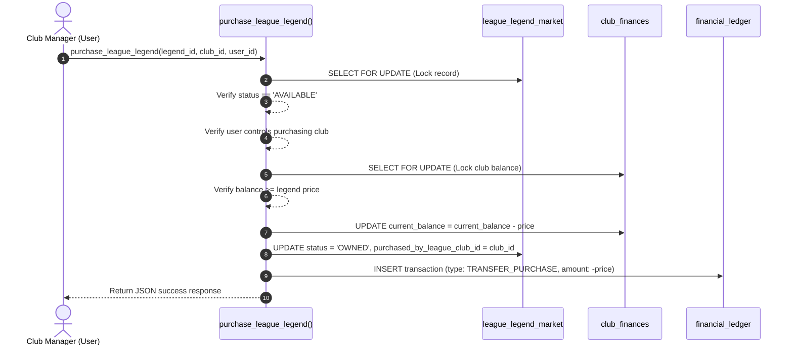

# Legend Transfers Architecture & Dataset Specification

## 1. Executive Summary & Purpose

The **Legend Transfers System** provides a per-league market allowing clubs to acquire legendary historical players at their prime peak versions (e.g. prime Cristiano Ronaldo, prime Lionel Messi, prime Marcelo, Gareth Bale, Eden Hazard, Luka Modrić, Toni Kroos, Xavi, Andrés Iniesta).

Each league operates an **isolated, independent Legend Market** where legends can be purchased by human-managed clubs without altering global active-player templates or conflicting with current-age active player identities.

---

## 2. Per-League Isolation & Ownership Policy

1. **Global Legend Dictionary (`legend_templates`)**:
   - Stores master template definitions for legendary players.
   - Identified by stable legend IDs (e.g. `leg-cristiano-ronaldo-prime`).
   - Prime versions maintain separate canonical keys (e.g. `cristiano-ronaldo-prime`) to guarantee zero collision with current-age active player identities.

2. **Per-League Market (`league_legend_market`)**:
   - Each created league instantiates its own isolated market records referencing `legend_templates`.
   - The same legend template can exist in multiple distinct leagues simultaneously.
   - Inside a single league, a legend can belong to **at most one club at any given time**.

3. **Status Lifecycle**:
   - `AVAILABLE`: Ready for purchase in the league market.
   - `OWNED`: Purchased by a club inside the league (`purchased_by_league_club_id IS NOT NULL`).
   - `LOCKED` / `SOLD`: Optionally reserved or unavailable for transfer.

---

## 3. Required Future Legends & Data-Research Policy

The completed dataset must contain historical peak stats for at least the following required legends:

- **Cristiano Ronaldo** (Prime version, e.g. 2011–2014)
- **Lionel Messi** (Prime version, e.g. 2011–2012)
- **Marcelo**
- **Gareth Bale**
- **Eden Hazard**
- **Luka Modrić**
- **Toni Kroos**
- **Xavi**
- **Andrés Iniesta**

> [!IMPORTANT]
> **Data Quality Rule:** Active legends (e.g. Cristiano Ronaldo, Lionel Messi, Luka Modrić) must be represented by their historical peak attributes, ratings, and valuation, rather than their current-age active ratings.

### Dataset Completeness Gate

- **Final Dataset Gate:** The completed dataset must contain **at least 3 legend entries for every supported primary position** across all 15 positions (`GK`, `CB`, `LB`, `RB`, `LWB`, `RWB`, `CDM`, `CM`, `CAM`, `LM`, `RM`, `LW`, `RW`, `CF`, `ST`).
- **Current Infrastructure State:** During Phase 4F, the technical foundation, Zod schema (`LegendSeedSchema`), validator (`src/data/validate-legends.ts`), draft file (`data/football/legends/legends.json`), and database tables/RPCs are fully operational. Data research and statistical population will occur in a dedicated data-research phase.

---

## 4. Transactional Purchase Flow & Balance Enforcement

Purchasing a legend is governed by the `purchase_league_legend` PL/pgSQL RPC function:

---

## 5. Security & Row-Level Security (RLS)

- **`legend_templates`**: Read-only for all authenticated users; modifications restricted to system admins.
- **`league_legend_market`**: Readable by authenticated members of the league (`league_members`).
- **Purchase Mutations**: Strictly restricted through `SECURITY DEFINER` RPC `purchase_league_legend` which enforces row-level locks, user ownership check, and atomic balance deduction.
