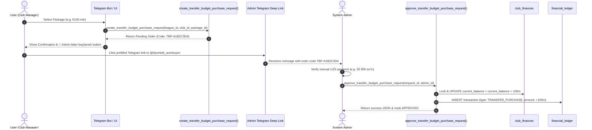

# Transfer Budget & Purchase Packages Specification

## 1. Executive Summary & Purpose

The **Transfer Budget System** manages club financial balances (`club_finances.current_balance`) used for player transfers, legend acquisitions, and team upgrades.

To allow users to expand their transfer budget for specific competitive leagues, the system provides **5 Configurable Real-Payment Packages** coordinated through Telegram.

---

## 2. Transfer Budget Packages

Packages are configured in a single database source of truth (`transfer_budget_packages`):

| Package ID | Display Name | EUR Budget Amount | UZS Price    | Sort Order |
| ---------- | ------------ | ----------------- | ------------ | ---------- |
| `pkg_10m`  | €10 million  | €10,000,000       | 5 000 so‘m   | 1          |
| `pkg_50m`  | €50 million  | €50,000,000       | 20 000 so‘m  | 2          |
| `pkg_100m` | €100 million | €100,000,000      | 35 000 so‘m  | 3          |
| `pkg_250m` | €250 million | €250,000,000      | 75 000 so‘m  | 4          |
| `pkg_500m` | €500 million | €500,000,000      | 125 000 so‘m | 5          |

### Important Per-League Warning

> ⚠️ **Muhim:** sotib olingan transfer mablag‘i faqat shu ligada va shu klub uchun amal qiladi. Mablag‘ boshqa ligaga yoki boshqa klubga avtomatik ko‘chirilmaydi.

---

## 3. User Order Flow & Admin Verification

---

## 4. Financial Ledger Auditing

Every approved transfer budget purchase creates a clean `financial_ledger` record:

- **Transaction Type:** `TRANSFER_PURCHASE`
- **Amount:** `+requested_eur_amount` (e.g. `+100000000.00`)
- **Description:** `Transfer Budget Purchase [TBP-A1B2C3D4]: +100000000 EUR (35000 UZS)`
- **Immutability:** Financial ledger records cannot be deleted or modified.
